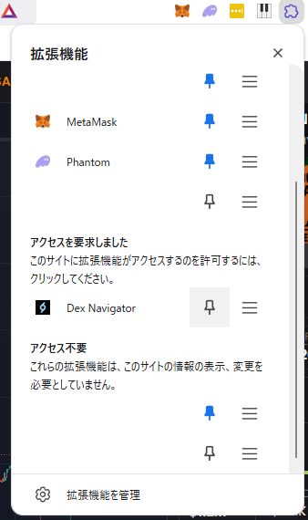

# Dex Navigator for bb✈ low-cap community
## 概要
- トークンページから他のサイトの**同じトークンページ**に移動します。  
  
方法: トークンページの画面内で右クリック(コンテキストメニュー)

- クリップボード内のCAから各種サイトのトークンページに移動します。  
  
方法: クリップボードにCAが入った状態でアイコンをクリック

- 選択中の文字列から各種サイトのトークンページに移動します。  
  
方法: CAを選択して右クリック

## 導入方法
1. このページから Code > Download ZIP とクリックしてzipをダウンロード  

1. Chromeのアドレスバーに chrome://extensions/ と入力して拡張機能タブを開く
1. 「パッケージ化されていない拡張機能を読み込む」ボタンから dex-navigator-main > dex-navigator ディレクトリを選択  

1. 拡張機能マークからDEX Navigatorをピン止めする  

