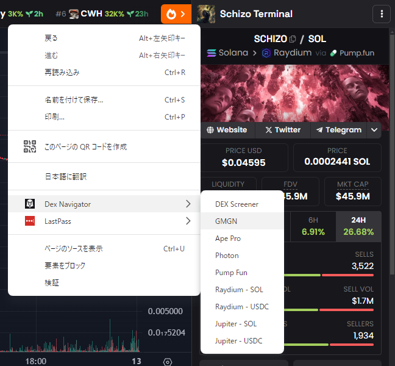

# Dex Navigator for bb✈ low-cap community
## 概要
何らかのサイトでトークンページを開いている際にコンテキストメニュー(右クリック)から移動したいサイトを選択するとそのサイトで**同じトークンの**ページを開くことができます  

## 導入方法
1. このページから Code > Download ZIP とクリックしてzipをダウンロード  

1. Chromeのアドレスバーに chrome://extensions/ と入力して拡張機能タブを開く
1. 「パッケージ化されていない拡張機能を読み込む」ボタンから dex-navigator-main > dex-navigator ディレクトリを選択  

