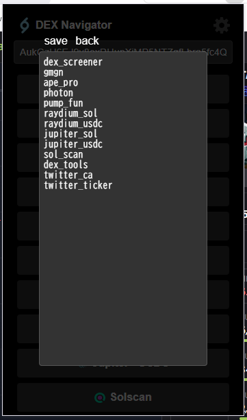

# Dex Navigator for bb✈ deep divers pub
## 概要
- トークンページから他のサイトの**同じトークンページ**に移動します。  
方法: トークンページの画面内で右クリック(コンテキストメニュー)  
  

- クリップボード内のCAから各種サイトのトークンページに移動します。  
方法: クリップボードにCAが入った状態でアイコンをクリック  
  

- 選択中の文字列から各種サイトのトークンページに移動します。  
方法: CAを選択して右クリック  
  

## 導入方法
1. このページから Code > Download ZIP とクリックしてzipをダウンロード  

1. Chromeのアドレスバーに chrome://extensions/ と入力して拡張機能タブを開く
1. 「パッケージ化されていない拡張機能を読み込む」ボタンから dex-navigator-main > dex-navigator ディレクトリを選択  

1. 拡張機能の詳細から「ツールバーに固定する」をON  


### アップデート方法
同様にダウンロードを行いフォルダを置き換えた後、拡張機能タブで再読み込みボタンを押してください。  


## 設定方法
ポップアップ画面右上の設定ボタンからIDを並び替えることでボタンの配置を変更できます。  
  
IDは以下の通り
```
dex_screener
gmgn
ape_pro
photon
pump_fun
raydium_sol
raydium_usdc
jupiter_sol
jupiter_usdc
sol_scan
dex_tools
twitter_ca
twitter_ticker
vector
```
